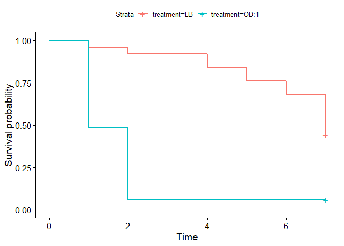

FLy_Infection_Survival_09272022
================
2022-11-15

### Load packages for analysis

Add in a link
<https://github.com/meschedl/Unckless_Lab_Resources/blob/main/Mentoring_Resources/R_scripts_Learning_R_%26_Stats/R-Markdown-and-Survival-Curve-Learning.md>

``` r
# load package survival
library("survival")
```

    ## Warning: package 'survival' was built under R version 4.2.2

``` r
# load package survminer
library("survminer")
```

    ## Warning: package 'survminer' was built under R version 4.2.2

    ## Loading required package: ggplot2

    ## Warning: package 'ggplot2' was built under R version 4.2.2

    ## Loading required package: ggpubr

    ## Warning: package 'ggpubr' was built under R version 4.2.2

    ## 
    ## Attaching package: 'survminer'

    ## The following object is masked from 'package:survival':
    ## 
    ##     myeloma

``` r
#write a function to transform a data.frame that has the column format 'vial | treatment | D0 | D1 | D2...', with one row for each vial
#into a long version in tidy format that can be input to make a survivorship curve
convert_df<-function(df){
  #open empty data.frame to store results
  results<-data.frame(vial=character(),treatment=character(),dead=numeric(),status=numeric())
  #This loop will index out each row (one row per vial) one at a time, transform it into long format (one row per fly), and add the information to the empty data.frame called results
  for(i in 1:nrow(df)){
  #isolate the row (vial) you want to work on
  temp<-df[i,]
    #iteratively isolate each day for this vial (day 0 must be column 3, day 1 column 4, etc.). Loop stops the column before the last day
    for(j in 3:(ncol(temp)-1)){
      #assign the number of flies that died in the vial on that day (starting with day 1) to the variable 'z'
      z<-temp[1,j]-temp[1,j+1]
        #if >0 flies died add this information to the results dataframe
        if(z>0){
          #iterate over 1 through total number of dead flies
          for(k in 1:z){
            #add a new row to the 'results' data.frame for the given dead fly, specifying vial #, treatment, day died, and
            #record the current vial #
            vial<-temp[,1]
            #record the treatment of the current vial
            treatment<-temp[,2]
            #record the death date of the flies that died on this day (assumes that your input DF starts with day 0 in column 3)
            dd<-j-2
            #append this information into a new row in the 'results' data.frame, and add a '1' in the 4th column to indicate mortality
            results[nrow(results)+1,]<- c(vial,treatment,dd,1)
          } #close for loop
        } #close if loop
    } #close for loop
  
  #now assign the number of flies remaining in the vial on the last day (value in the last column of the row) to the variable 'z'
  z<-temp[1,j+1]
    #if there are any flies alive in the vial on the last day
    if(z>0){
      #iterate over 1:(number of flies alive on the last day)
      for(l in 1:z){
        #record the current vial #
        vial<-temp[,1]
        #record the treatment of the current vial
        treatment<-temp[,2]
        #record the last day we recorded this fly alive (assumes that your input DF starts with day 0 in column 3)
        dd<-j-2
        #append this information into a new row in the 'results' data.frame, and add a '0' in the 4th column to indicate that the fly made it to the end of the experiment
        results[nrow(results)+1,]<- c(vial,treatment,dd,0)
      } #close for loop
    } #close if loop
  } #close original for loop
results$dead<-as.numeric(results$dead)  #reiterate that this column must be class numeric
results$status<-as.numeric(results$status)  #reiterate that this column must be class numeric
results$vial <- as.factor(results$vial) # make sure vial is considered a factor
# gives you only the results dataframe as output from function 
return(results) 
} #close function
```

``` r
# Note that all code from now on will be commented to be able to knit with R Markdown. If your code doesn't work, the program will not knit it. Because this code is examples, it doesn't actually run. Delete the three hashes ### before the actual line of code and modify it with your own code

# read the file from csv
###
### file_name  <- read.csv("full/path/to/your/file.csv")
###

male_innubila_infections <- read.csv("C:\\Users\\Ngoc Huan\\Desktop\\Github_Notebooks\\NgocHuan_Open_Lab_Notebook\\FLy_Survival_ANalysis\\20220927_male_innubila_infections.csv")

# Now you want to check what the dataframe looks like so you can know what columns you need to keep 
# Just look at the first 10 rows with head()
###
head(male_innubila_infections)
```

    ##   Vial     Species Treatment Replicate Day_emerged Day_Infected Time_Infected
    ## 1    1 D. innubila        LB         1   9/20-9/22    9/27/2022          4:30
    ## 2    2 D. innubila      OD:1         1   9/20-9/23    9/27/2022          4:30
    ## 3    3 D. innubila      OD:1         2   9/20-9/24    9/27/2022          4:43
    ## 4    4 D. innubila        LB         2   9/20-9/25    9/27/2022          4:51
    ## 5    5 D. innubila      OD:1         3   9/20-9/26    9/27/2022          4:59
    ## 6    6 D. innubila      OD:1         4   9/20-9/27    9/27/2022          5:07
    ##   Time.on.CO2  fly_age OD600 Number_of_flies_per_vial Day_1_survival
    ## 1           7 5-7 days    NA                        6              6
    ## 2           9 5-7 days    NA                        5              1
    ## 3           6 5-7 days    NA                       10              5
    ## 4           6 5-7 days    NA                       10             10
    ## 5           6 5-7 days    NA                       10              5
    ## 6           6 5-7 days    NA                       10              6
    ##   Day_2_survival Day_3_survival Day_4_survival Day_5_survival Day_6_survival
    ## 1              6              6              4              4              2
    ## 2              0              0              0              0              0
    ## 3              0              0              0              0              0
    ## 4             10             10             10              9              9
    ## 5              0              0              0              0              0
    ## 6              2              2              2              2              2
    ##   Day_7_survival Notes
    ## 1              1    NA
    ## 2              0    NA
    ## 3              0    NA
    ## 4              6    NA
    ## 5              0    NA
    ## 6              2    NA

``` r
###

# Subset dataframe to be only the columns needed, the numbers of the columns can be different for each dataset depending on what information you record 
# to subset the columns, you do file_name[,c(column numbers)]
# inside the [ ] before the comma means rows, and after the comma means columns
# you just use the number of the column to tell R what to keep 
# if you have a set of columns that are next to each other, like columns 9 through 12, you can represent that as 9:12
###
male_innubila_infections_subset <- male_innubila_infections[,c(1,3,11:18)]
###

# Again you want to check that the code worked, and that your subset is the columns you actually wanted 
###
head(male_innubila_infections_subset)
```

    ##   Vial Treatment Number_of_flies_per_vial Day_1_survival Day_2_survival
    ## 1    1        LB                        6              6              6
    ## 2    2      OD:1                        5              1              0
    ## 3    3      OD:1                       10              5              0
    ## 4    4        LB                       10             10             10
    ## 5    5      OD:1                       10              5              0
    ## 6    6      OD:1                       10              6              2
    ##   Day_3_survival Day_4_survival Day_5_survival Day_6_survival Day_7_survival
    ## 1              6              4              4              2              1
    ## 2              0              0              0              0              0
    ## 3              0              0              0              0              0
    ## 4             10             10              9              9              6
    ## 5              0              0              0              0              0
    ## 6              2              2              2              2              2

``` r
###
```

``` r
# convert the subsetted dataframe using the function above 
### 
male_innubila_infections_subset_convert <- convert_df(male_innubila_infections_subset)
###

# check how the converted dataframe looks 
###
head(male_innubila_infections_subset_convert)
```

    ##   vial treatment dead status
    ## 1    1        LB    4      1
    ## 2    1        LB    4      1
    ## 3    1        LB    6      1
    ## 4    1        LB    6      1
    ## 5    1        LB    7      1
    ## 6    1        LB    7      0

``` r
###
```

``` r
# first you need to make the model using the survfit function. All you have to do is add in the name of the dataframe, the names of the 
# columns of the dataframe should always be the same because of the convert function we used 
###
male_innubila_infections_subset_convert_fit <- survfit(Surv(dead, status) ~ treatment, data=male_innubila_infections_subset_convert)
###

# then we use a ggplot specific for the survfit model to plot it. Again the only thing you need to add in is the name of your model
###
ggsurvplot(male_innubila_infections_subset_convert_fit)
```

<!-- -->

``` r
          ### pval = TRUE, conf.int = TRUE, # add the p-value into the graph
          ### linetype = "strata", # Change line type by groups
          ### ggtheme = theme_bw()) # Change ggplot2 theme
###
```
